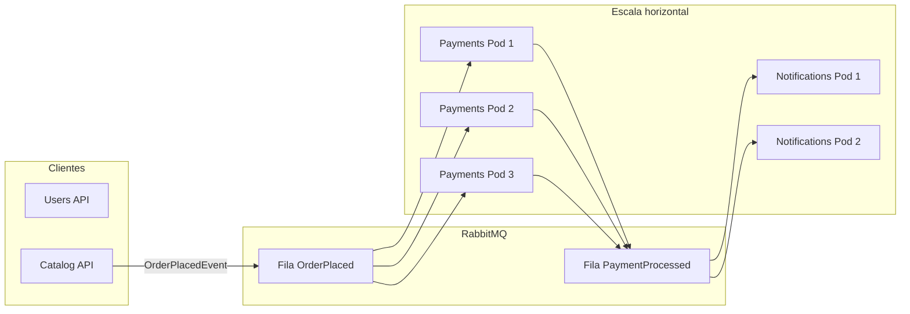

# Escalabilidade — FCG Fase 2

Como a arquitetura de **microsserviços + mensageria** permite escalar partes do sistema de forma independente.

---

## Por que escala aqui?

| Componente | Escala horizontal? | Motivo |
|------------|-------------------|--------|
| **Users API** | Sim | Stateless (JWT); DB proprio |
| **Catalog API** | Sim* | API stateless; biblioteca exige DB compartilhado ou por replica |
| **Payments API** | **Sim (ideal)** | Consumidor RabbitMQ; idempotencia por `OrderId` |
| **Notifications API** | **Sim (ideal)** | Consumidor RabbitMQ; e-mails independentes |
| **RabbitMQ** | Cluster (prod) | Fila central distribui carga entre consumidores |

\* Em producao, use PostgreSQL (ou SQLite em dev) com **uma** instancia de dados ou sharding; varias replicas de Catalog apontam para o **mesmo** banco.



Cada replica de **Payments** compete pela mesma fila — RabbitMQ entrega mensagens para **um** consumidor por vez (load balancing natural).

---

## 1. Docker Compose — escalar consumidores

Arquivo overlay: [`docker-compose.scalability.yml`](docker-compose.scalability.yml) (remove portas fixas de Payments/Notifications para evitar conflito).

> **Pre-requisito:** as imagens `fcg/*:latest` precisam existir localmente — o compose usa `image:`, nao builda. Rode `.\build-images.ps1` antes (ver [`README.md`](README.md)).

```powershell
docker compose -f docker-compose.yml -f docker-compose.scalability.yml up -d `
  --scale payments-api=3 `
  --scale notifications-api=2

docker compose -f docker-compose.yml -f docker-compose.scalability.yml ps
```

**Verificar:** http://localhost:15672 → **Queues** → consumidores aumentam quando ha multiplas replicas.

**Teste:** dispare varias compras (Catalog). Nos logs:

```powershell
docker compose logs payments-api --tail 50
```

Voce vera diferentes containers (`payments-api-1`, `payments-api-2`, ...) processando pedidos.

---

## 2. Kubernetes — replicas no Deployment

Exemplo com **3 replicas** do Catalog: [`k8s/scaling/deployment-catalog-scaled.example.yaml`](k8s/scaling/deployment-catalog-scaled.example.yaml)

```powershell
kubectl apply -f k8s/scaling/deployment-catalog-scaled.example.yaml
```

Ou escale via CLI:

```powershell
kubectl scale deployment catalog-api --replicas=3
kubectl scale deployment payments-api --replicas=3
kubectl get pods -l app=payments-api
```

O **Service** (`payments-api:80`) faz load balance entre os Pods automaticamente.

---

## 3. Kubernetes — HPA (Horizontal Pod Autoscaler)

Manifestos de exemplo em [`k8s/scaling/`](k8s/scaling/):

| Arquivo | Servico | Min | Max |
|---------|---------|-----|-----|
| `hpa-payments-api.yaml` | payments-api | 2 | 5 |
| `hpa-notifications-api.yaml` | notifications-api | 2 | 4 |

**Pre-requisito:** metrics-server no cluster (Docker Desktop K8s costuma incluir).

```powershell
kubectl apply -f k8s/scaling/hpa-payments-api.yaml
kubectl apply -f k8s/scaling/hpa-notifications-api.yaml
kubectl get hpa
```

Simule carga (exemplo):

```powershell
kubectl run load-gen --image=busybox --restart=Never -- /bin/sh -c "while true; do wget -q -O- http://payments-api/health; done"
```

Observe `kubectl get hpa -w` — replicas sobem conforme CPU.

---

## 4. Idempotencia (essencial para escalar Payments)

Varias replicas de **Payments** nao devem cobrar o mesmo pedido duas vezes.

Implementacao atual:

- Verificacao de `OrderId` ja processado antes de publicar `PaymentProcessedEvent`
- Constraint de PK em `ProcessedOrders.OrderId`

Isso permite **scale out** seguro dos consumidores.

---

## Voltar ao modo normal (1 replica)

```powershell
docker compose -f docker-compose.yml -f docker-compose.scalability.yml down
docker compose up -d
```

```powershell
kubectl scale deployment payments-api --replicas=1
```

---

Ver tambem: [`TESTE_PAGAMENTOS_MAILPIT.md`](TESTE_PAGAMENTOS_MAILPIT.md)
