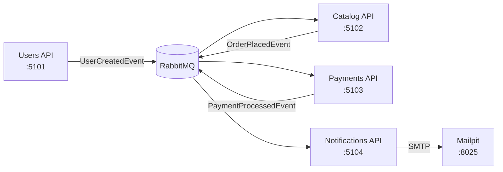

# FCG Platform — orquestração (Fase 2)

Repositório de **orquestração** da FIAP Cloud Games. Não contém código de aplicação: reúne o `docker-compose.yml` que sobe a stack completa, os manifestos de **infraestrutura** para Kubernetes (RabbitMQ e Mailpit) e os scripts que amarram tudo.

As quatro APIs vivem em repositórios próprios:

| Serviço | Repositório | Imagem Docker | Porta (host) |
|---------|-------------|---------------|--------------|
| Users API | `fcg-users-api` | `fcg/users-api:latest` | 5101 |
| Catalog API | `fcg-catalog-api` | `fcg/catalog-api:latest` | 5102 |
| Payments API | `fcg-payments-api` | `fcg/payments-api:latest` | 5103 |
| Notifications API | `fcg-notifications-api` | `fcg/notifications-api:latest` | 5104 |

```
fcg-platform/
├── docker-compose.yml              stack completa (RabbitMQ + Mailpit + 4 APIs)
├── docker-compose.scalability.yml  overlay para escalar consumidores
├── build-images.ps1                builda as 4 imagens a partir dos repos de API
├── deploy-k8s.ps1                  aplica infra + manifestos das 4 APIs no cluster
└── k8s/
    ├── rabbitmq.yaml               Deployment + Service (broker)
    ├── mailpit.yaml                Deployment + Service (SMTP de teste)
    └── scaling/                    exemplos de HPA e réplicas (não aplicados por padrão)
```

---

## Pré-requisitos

- **Docker Desktop** (com Compose v2)
- **kubectl** + Kubernetes habilitado no Docker Desktop (só para a parte de K8s)
- Os **4 repositórios de API clonados**, lado a lado, na mesma pasta que este repo:

```
<pasta-de-trabalho>/
├── fcg-platform/            ← você está aqui
├── fcg-users-api/
├── fcg-catalog-api/
├── fcg-payments-api/
└── fcg-notifications-api/
```

---

## Rodar com Docker

> ⚠️ **Pré-passo obrigatório.** Este compose usa `image:`, não `build:` — o código-fonte de cada API está em outro repositório. Sem as imagens `fcg/*:latest` no Docker local, o `docker compose up` falha com *"image not found"*.

### 1. Buildar as imagens

```powershell
.\build-images.ps1
```

O script encontra os 4 repos irmãos e builda cada imagem a partir da raiz do repo correspondente. Se eles estiverem em outro lugar:

```powershell
.\build-images.ps1 -ReposRoot D:\caminho\para\os\repos
```

Equivalente manual — na raiz de **cada** repo de API:

```powershell
docker build -f Users.Api/Dockerfile         -t fcg/users-api:latest         .
docker build -f Catalog.Api/Dockerfile       -t fcg/catalog-api:latest       .
docker build -f Payments.Api/Dockerfile      -t fcg/payments-api:latest      .
docker build -f Notifications.Api/Dockerfile -t fcg/notifications-api:latest .
```

### 2. Subir a stack

```powershell
docker compose up -d
docker compose ps
```

Para parar: `docker compose down` (com `-v` para apagar também os bancos SQLite).

### 3. URLs

| Serviço | URL | Observação |
|---------|-----|------------|
| Users API | http://localhost:5101/swagger | autenticação / JWT |
| Catalog API | http://localhost:5102/swagger | jogos e biblioteca |
| Payments API | http://localhost:5103/swagger | pagamento simulado |
| Notifications API | http://localhost:5104/swagger | consumidor de eventos |
| RabbitMQ Management | http://localhost:15672 | `guest` / `guest` |
| **Mailpit** | http://localhost:8025 | caixa de entrada dos e-mails |

Guia de teste (pagamento aprovado × recusado): [`TESTE_PAGAMENTOS_MAILPIT.md`](TESTE_PAGAMENTOS_MAILPIT.md) · Escalabilidade: [`ESCALABILIDADE.md`](ESCALABILIDADE.md)

---

## Rodar no Kubernetes

Mesmo pré-passo: as imagens precisam existir localmente (`.\build-images.ps1`). Os Deployments usam `imagePullPolicy: IfNotPresent`, então o cluster do Docker Desktop consome as imagens do daemon local, sem registry.

> Em **Kind**, carregue-as antes: `kind load docker-image fcg/users-api:latest` (repetir para as 4).

### Deploy de uma vez

```powershell
.\deploy-k8s.ps1
kubectl get pods
```

O script aplica, nesta ordem: `k8s/rabbitmq.yaml`, `k8s/mailpit.yaml` e depois a pasta `k8s/` da raiz de cada um dos 4 repos de API. Para remover tudo: `.\deploy-k8s.ps1 -Delete`.

### Deploy manual

```powershell
kubectl apply -f k8s/rabbitmq.yaml
kubectl apply -f k8s/mailpit.yaml
kubectl apply -f ..\fcg-users-api\k8s\
kubectl apply -f ..\fcg-catalog-api\k8s\
kubectl apply -f ..\fcg-payments-api\k8s\
kubectl apply -f ..\fcg-notifications-api\k8s\
kubectl get pods
```

### Acessar os serviços

Os Services são `ClusterIP` na porta **80** (→ 8080 no container). Use port-forward, um por terminal:

```powershell
kubectl port-forward svc/users-api 5101:80
kubectl port-forward svc/catalog-api 5102:80
kubectl port-forward svc/mailpit 8025:8025
```

### Comunicação entre pods

Cada serviço acha os outros pelo **nome do Service**, não por IP: `rabbitmq:5672` (broker), `mailpit:1025` (SMTP). É o mesmo nome usado no compose, então nenhuma configuração muda entre Docker e Kubernetes.

> ⚠️ **`jwt-key` precisa ser idêntica** nos `secret.yaml` de **Users** e **Catalog** — o token é emitido por um e validado pelo outro. Se divergirem, o Catalog responde **401** em toda requisição autenticada.

---

## Variáveis de ambiente (compose)

Definidas em `docker-compose.yml`; no Kubernetes, as mesmas chaves vêm do `configmap.yaml` e do `secret.yaml` de cada repo de API.

| Variável | Serviços | Padrão | Descrição |
|----------|----------|--------|-----------|
| `JWT_KEY` | users, catalog | chave de dev (32+ chars) | Assinatura do JWT. **Precisa ser a mesma nos dois.** |
| `Jwt__Issuer` / `Jwt__Audience` | users, catalog | `FCG` | Emissor e audiência do token. |
| `RabbitMq__Host` | todos | `rabbitmq` | Nome do Service/container do broker. |
| `RabbitMq__Username` / `Password` | todos | `guest` | Credenciais do RabbitMQ. |
| `ConnectionStrings__DefaultConnection` | users, catalog, payments | `Data Source=/app/data/<svc>.db` | SQLite em volume nomeado. |
| `Payments__SimulationMode` | payments | `Random` | `Random`, `AlwaysApprove` ou `AlwaysReject`. |
| `Payments__ApprovalRate` | payments | `0.92` | Taxa de aprovação no modo `Random`. |
| `Payments__RejectPrices__0` | payments | `99.99` | Preço que sempre é recusado (para demo). |
| `Smtp__Host` / `Smtp__Port` | notifications | `mailpit` / `1025` | Servidor SMTP de teste. |
| `Smtp__FromAddress` / `Smtp__FromName` | notifications | `noreply@fcg.local` / `FIAP Cloud Games` | Remetente dos e-mails. |

Para sobrescrever a chave JWT, crie um `.env` nesta pasta:

```
JWT_KEY=uma_chave_secreta_com_pelo_menos_32_caracteres
```

---

## Fluxo de demonstração

1. **Login admin** (seed em Development): `POST http://localhost:5101/api/auth/login` — `admin@fcg.local` / `Admin@123`.
2. Com o token **Bearer**, criar um jogo: `POST http://localhost:5102/api/games`.
3. **Registrar usuário**: `POST http://localhost:5101/api/auth/register` → `UserCreatedEvent` → e-mail de boas-vindas no **Mailpit**.
4. **Comprar** (logado como o usuário): `POST http://localhost:5102/api/users/me/library/games/{gameId}` → **202** com `orderId` → `OrderPlacedEvent` → Payments processa → `PaymentProcessedEvent` → jogo entra na biblioteca (`GET /api/users/me/library`) e o e-mail de confirmação aparece no Mailpit.

Acompanhar os eventos: `docker compose logs -f payments-api notifications-api`

---

## Arquitetura



Comunicação **assíncrona** via RabbitMQ + MassTransit. Os contratos de evento (`UserCreatedEvent`, `OrderPlacedEvent`, `PaymentProcessedEvent`) são compartilhados pelo projeto `FCG.Messaging.Contracts`, copiado em cada repo de API.
